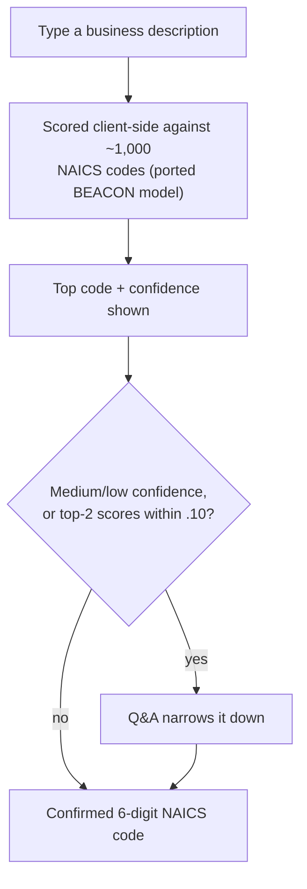

# NAICS Code Resolver

A tool that resolves the 6-digit NAICS code for a business based on a
free-text description, using a machine learning model, entirely in your web
browser — no server, no API calls, no data leaves your machine.

The model is a TypeScript port of the [Census Bureau's BEACON
model](https://github.com/uscensusbureau/beacon). A ~5MB (gzipped) model
file loads on page load and scores your description against all ~1,000
six-digit NAICS codes using n-gram matching. High-confidence matches show
the code directly; medium/low-confidence matches offer a drill-down Q&A,
seeded from the model's own top candidates, to narrow down to a single
confirmed code. Confidence thresholds and the NAICS hierarchy itself come
from official Census Bureau data — nothing is generated by a model or an
LLM.

**Live:** https://krcourville.github.io/naics-code-resolver/

## How does it work?



The top-scoring code and its confidence are always shown first. When
confidence is medium/low, or the top two candidates are close (within .10
of each other, even at high confidence), a Q&A step offers the model's own
top candidate codes as picks; picking one confirms it, or you can browse
the full official NAICS hierarchy from the top down (sector → subsector →
… → national industry) until a single 6-digit code is confirmed.

## Why this exists

This project is an experiment answering one question: **can a machine
learning model run entirely in the web browser, with no backend?** No
inference server, no API call, no data leaving the machine — just a model
artifact fetched as a static file and scored in JS.

## Porting BEACON to the browser

BEACON ships as a scikit-learn `BaseEstimator` — a hand-rolled Python
pipeline (text cleaning, stemming, n-gram dictionary lookup, purity-weighted
scoring) rather than a standard sklearn `Pipeline`. That ruled out the usual
export path: `skl2onnx` has no registered converter for a custom estimator
like this, so ONNX export (and running it via onnxruntime-web) was a dead
end. Instead, the fit/predict logic was ported by hand to TypeScript, and
only the _fitted parameters_ — n-gram dictionaries, purity weights, sector
groupings — are exported to JSON and shipped as a static asset.

The naive export was unshippable: BEACON stores those weights as dense
per-sector float arrays (one slot per NAICS code, whether or not the code
scored), and dense export ballooned to **391MB**. But the weights are
~98.8% zero — BEACON's purity weighting concentrates each n-gram on
essentially one code (1.17 nonzero entries/key on average). Switching to a
sparse `{ngram: {naicsCode: proportion}}` encoding, rounding weights to 6
decimals, and compacting the JSON brought that down to the **~47MB /
~5MB gzipped** file shipped today. Browsers negotiate gzip transparently, so
that ~5MB is what actually crosses the wire on page load.

Two small accuracy costs from the port — the hand-ported TS logic, and
6-decimal weight rounding — are checked by a parity test suite
(`beacon-model.parity.test.ts`) against the real Python BeaconModel: same
predicted codes, `predict_proba` scores matching to 4 decimal places, same
top-10 order. Neither cost flips a prediction in the test set.

## Is this practical?

For this model: yes. ~1,000 output classes, sparse n-gram weights, ~5MB
gzipped — comfortably within normal static-hosting and page-weight budgets,
and it loads asynchronously so it never blocks the text input (see the flow
diagram above).

That budget doesn't generalize to ML in the browser broadly:

- **Dense weight matrices don't compress like this.** BEACON's sparsity
  came from a specific modeling choice (purity-weighted n-gram scoring). A
  neural net's weights are dense floats through and through — no free
  98.8%-zero lunch, so a dense model of comparable _parameter count_ would
  ship far heavier.
- **Where it breaks down:** tens of MB (gzipped) starts to hurt on
  mobile/slow connections; past a couple hundred MB you're fighting browser
  memory limits and load-time patience, not just bandwidth. Budget it like
  any other page-weight-sensitive asset. Modern quantized small LLMs (a few
  hundred MB to a few GB) are already past the point where "just fetch it
  on page load" is reasonable — those need explicit user opt-in, caching
  (Cache API/OPFS), and a loading UX that admits it's downloading a real
  model.
- **Exposure cuts both ways.** Whatever's fetched on page load sits in the
  browser cache and network tab, fully downloadable by anyone who opens the
  page — there's no server boundary hiding it. That's the privacy win
  (nothing leaves the machine) and the IP cost (nothing stays hidden,
  either) at the same time. Fine here: BEACON is CC0/public domain, nothing
  to protect. For a proprietary model, "runs client-side" and "keeps the
  model confidential" are in direct tension.
- **Backend-shaped needs don't go away.** Client-side inference has no
  server to log predictions/confidence/corrections through, so there's no
  natural point to capture data for a retraining or monitoring loop.
  Several apps/services needing the same inference points toward one
  shared backend, not N copies of the model re-shipped into N clients.
  Updating the artifact still needs a cache/versioning story even without
  a server. Any of these — observability, multiple consumers, artifact
  versioning — can outweigh the "no backend" win on its own. Client CPU/
  battery cost of inference also scales with model complexity (this
  model's n-gram lookup is cheap; a neural net forward pass is not).

## Improvement ideas

- **Synonym/hypernym expansion at fit time.** Widen the n-gram dictionary
  with a WordNet-style pass when the model is fit, so vocabulary mismatches
  ("fix cars" vs. "automotive repair") get caught without touching the
  runtime or the bundle size.
- **Semantic similarity via a small embedding model.** A quantized
  sentence-transformer (e.g. via transformers.js) running client-side,
  blended with the existing n-gram score, would catch meaning matches that
  share no vocabulary at all. Bigger lift than synonym expansion — pulls
  the bundle-size/practicality tradeoff above back into play, since a real
  embedding model is heavier and slower than BEACON's sparse dictionary.

## Getting Started

```bash
git submodule update --init   # pulls the beacon submodule
vp install                    # installs deps
vp dev                        # dev server at http://localhost:5173
```

Type a business description, get a 6-digit NAICS code + confidence.
Low/medium confidence offers a drill-down Q&A to narrow it down.

### Tests

```bash
vp test                       # unit tests (vitest)
vp check                      # format + lint + typecheck
pnpm exec playwright test     # e2e suite (starts dev server itself)
```

First e2e run needs browsers: `pnpm exec playwright install chromium`.

### Build

```bash
pnpm build                    # tsc + vp build -> dist/
```

The model artifact (`public/naics-model.json`) is committed, not
regenerated during build. To refit it manually: `python scripts/build-model.py`
(needs the beacon submodule). `pnpm infer "<description>"` queries the
committed model directly, useful for manual sanity checks.
