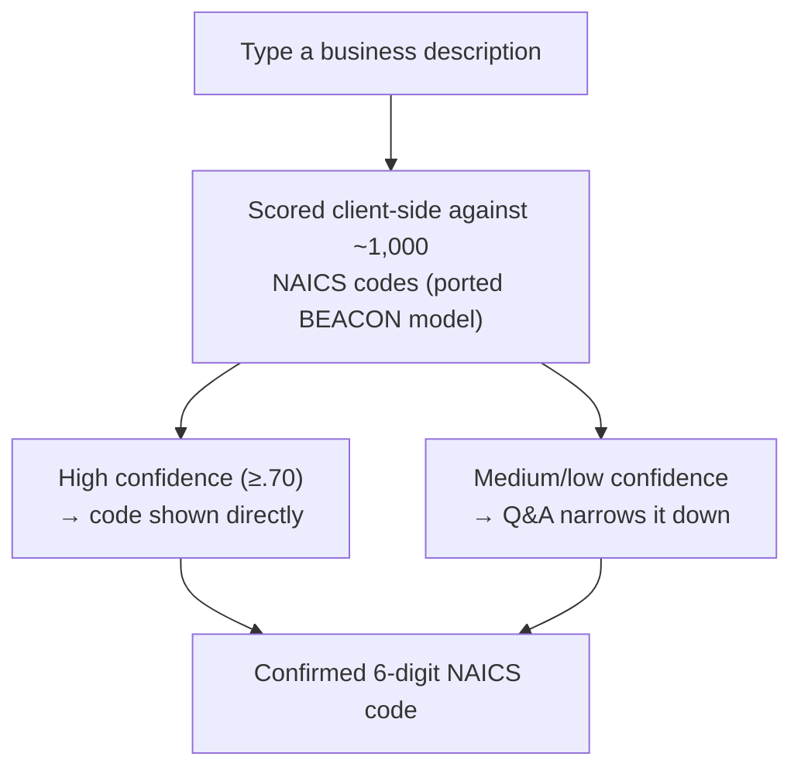

# NAICS Code Resolver

A tool that resolves the 6-digit NAICS code for a business based on a
free-text description, using a machine learning model, entirely in your web
browser — no server, no API calls, no data leaves your machine.

The model is a TypeScript port of the [Census Bureau's BEACON
model](https://github.com/uscensusbureau/beacon). A ~5MB model file loads on
page load and scores your description against all ~1,000 six-digit NAICS
codes using n-gram matching. High-confidence matches show the code directly;
medium/low-confidence matches offer a drill-down Q&A, seeded from the
model's own top candidates, to narrow down to a single confirmed code.
Confidence thresholds and the NAICS hierarchy itself come from official
Census Bureau data — nothing is generated by a model or an LLM.

**Live:** https://krcourville.github.io/naics-code-resolver/

## How does it work?



Medium/low-confidence results offer the model's own top candidate codes as
picks; picking one confirms it, or you can browse the full official NAICS
hierarchy from the top down (sector → subsector → … → national industry)
until a single 6-digit code is confirmed.

## Getting Started

```bash
git submodule update --init   # pulls the beacon submodule
vp install                    # installs deps
vp dev                        # dev server at http://localhost:5173
```

Type a business description, get a 6-digit NAICS code + confidence.
Low/medium confidence offers a drill-down Q&A to narrow it down.

### Tests

```bash
vp test                       # unit tests (vitest)
vp check                      # format + lint + typecheck
pnpm exec playwright test     # e2e suite (starts dev server itself)
```

First e2e run needs browsers: `pnpm exec playwright install chromium`.

### Build

```bash
pnpm build                    # tsc + vp build -> dist/
```

The model artifact (`public/naics-model.json`) is committed, not
regenerated during build. To refit it manually: `python scripts/build-model.py`
(needs the beacon submodule). `pnpm infer "<description>"` queries the
committed model directly, useful for manual sanity checks.
